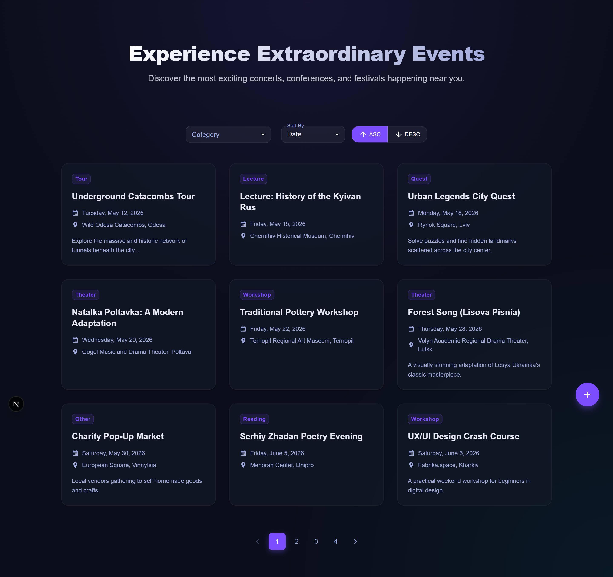

# Event Management System

## Screenshots

<p align="center">
  
</p>

<p align="center">
  
  
</p>

---

## Tech Stack

- **Containerization**: [Docker](https://www.docker.com/) & Docker Compose
- **Package Manager**: [pnpm](https://pnpm.io/)

### Frontend

- **Framework**: [Next.js](https://nextjs.org/) (React)
- **UI Library**: [Material UI](https://mui.com/)
- **Validation**: [Zod](https://zod.dev/) & [React Hook Form](https://react-hook-form.com/)

### Backend

- **Framework**: [NestJS](https://nestjs.com/)
- **Database**: [PostgreSQL](https://www.postgresql.org/)
- **ORM**: [Drizzle ORM](https://orm.drizzle.team/)
- **Validation**: [Zod](https://zod.dev/)

---

## Setup Instructions

### 1. Configure Environment Variables

Rename the `.example.env` files to `.env` in both the `client` and `server` directories.

### 2. Start the Applications

Use Docker Compose to build and start the database, server, and client containers:

```bash
docker compose up
```

### 3. Seed the Database

In a new terminal, navigate to the `server` directory and run the database seed script:

```bash
cd server
pnpm run db:seed
```

### 4. Access the Application

Once the containers are running and the database is seeded, you can access the application at:
**[http://localhost:3000](http://localhost:3000)**

---

## Scripts

### Backend Scripts (in `/server`)

- `pnpm run dev`: start NestJS in watch mode.
- `pnpm run db:generate`: generate database migrations.
- `pnpm run db:migrate`: run database migrations.
- `pnpm run db:studio`: open Drizzle Studio to explore data.

### Frontend Scripts (in `/client`)

- `pnpm run dev`: start Next.js development server.
